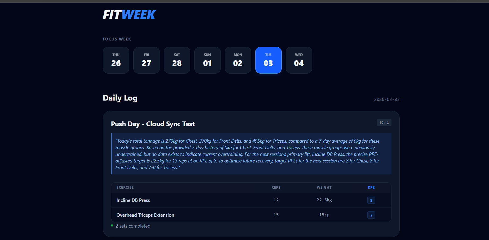
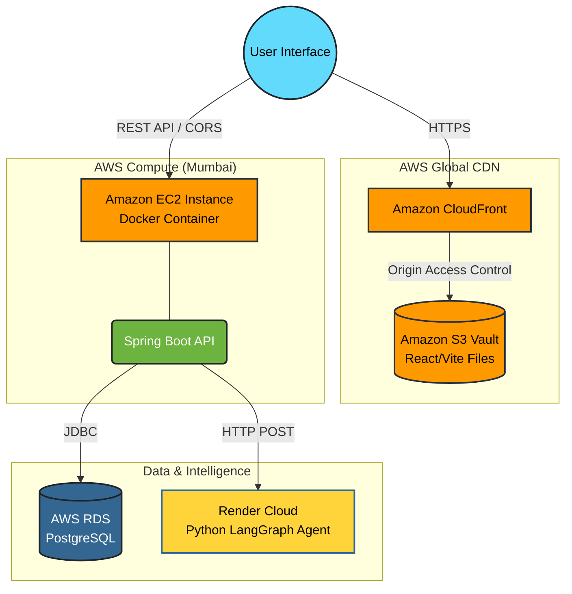

# FitWeek: AI-Powered Fitness Automation & Tracking 🏋️‍♂️🤖

*A high-performance, cloud-native fitness application featuring an autonomous AI coaching agent.*

## 📖 Overview
FitWeek is a distributed full-stack application designed to track strength training progress while providing real-time, context-aware coaching. Built with a microservices-inspired architecture, it bridges an **Enterprise Java Backend**, a **Global CDN-delivered React Frontend**, and an **Autonomous Python AI Agent**. 

This project was developed to demonstrate mastery in cloud infrastructure (AWS), secure cross-origin communication, containerization, and advanced AI engineering.

---

## 🚀 Core Architecture & Capabilities

### 🧠 Agentic AI System (Python & LangGraph)
Unlike standard conversational wrappers, FitWeek utilizes an **Agentic AI Workflow** to generate coaching insights. 
* **Autonomous Reasoning:** The Python microservice employs multi-step reasoning to analyze workout data, utilizing nodes for planning, research, and critique before delivering the final coaching output.
* **Context-Aware Recommendations:** The agent evaluates exercise selection, RPE (Rate of Perceived Exertion), and volume to provide actionable, biomechanically sound advice.
* **Decoupled Architecture:** Hosted independently, the AI service acts as a specialized worker node that the core backend communicates with securely.

### ⚙️ Enterprise Java Backend (Spring Boot)
The core engine is built for reliability, security, and scale.
* **RESTful Architecture:** Built a robust API layer using Java Spring Boot to manage workout sessions, user telemetry, and cross-service AI communication.
* **Containerization:** The entire backend environment is containerized using **Docker** and stored securely in a private container registry.
* **Security & CORS:** Implemented rigorous security configurations, explicitly handling Cross-Origin Resource Sharing (CORS) preflight requests and managing secure boundaries between the HTTP backend and HTTPS frontend.

### ☁️ AWS Cloud Infrastructure
The system is deployed using industry-standard DevOps and cloud delivery patterns.
* **S3 & CloudFront (Global CDN):** The React frontend is hosted securely in an Amazon S3 Vault, utilizing Origin Access Control (OAC), and delivered globally via Amazon CloudFront with HTTPS enforcement.
* **EC2 & ECR:** The backend Docker image is pushed to Amazon Elastic Container Registry (ECR) and deployed on an Amazon EC2 instance.
* **Amazon RDS:** Persistent, secure data storage is managed via an Amazon Relational Database Service (RDS) PostgreSQL instance.

---

## 🛠️ Technology Stack

**AI & Data Engineering**
* Python 3
* LangGraph (Agentic Workflows)
* Large Language Models (LLMs)

**Backend & Database**
* Java 17 / Spring Boot
* PostgreSQL (Relational Database)
* REST API Design
* Axios (Inter-service HTTP communication)

**Frontend**
* React.js (Vite)
* TypeScript
* Tailwind CSS

**Cloud & DevOps (AWS)**
* Amazon EC2 (Elastic Compute Cloud)
* Amazon S3 (Simple Storage Service)
* Amazon CloudFront (Content Delivery Network)
* Amazon RDS (Relational Database Service)
* Amazon ECR (Elastic Container Registry)
* Docker
* Maven

---

## ⚙️ System Design Diagram

---

## 🔒 Security Implementations
* **Origin Access Control (OAC):** Ensures the S3 bucket is completely isolated from the public internet, accessible only by the CloudFront distribution.
* **Strict CORS Policies:** Backend explicitly rejects unauthorized cross-origin requests, trusting only the specific CloudFront domain.
* **Environment Variable Management:** Secrets, database credentials, and API keys are injected at runtime via Docker, completely decoupled from the codebase.
